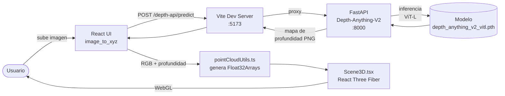
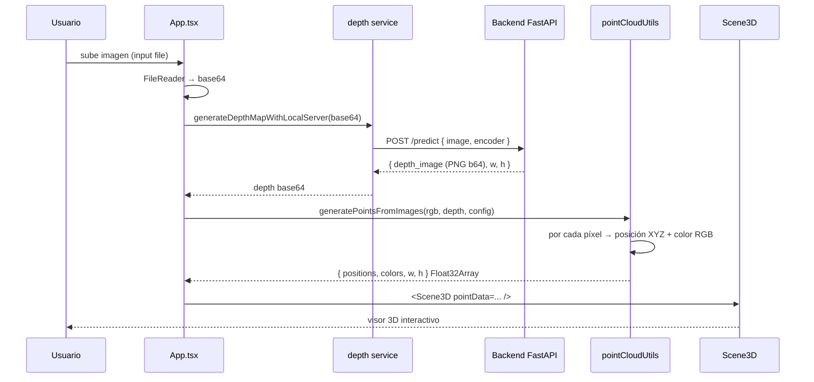

# image_to_xyz — Frontend

Aplicación web que convierte una **imagen 2D en una nube de puntos 3D navegable** usando un mapa de profundidad estimado por IA. El render se hace en el navegador con Three.js / React Three Fiber.

Es la mitad **frontend** de un sistema en dos partes:

- `image_to_xyz` (este repo) — UI en React + Vite, generación de la nube de puntos y visor 3D.
- [`Depth-Anything-V2`](../Depth-Anything-V2) — Backend Python (FastAPI) que sirve el modelo Depth-Anything-V2 para estimar profundidad.

---

## ¿Qué hace?

1. El usuario sube una imagen.
2. Se envía a un proveedor de **estimación de profundidad** (configurable: servidor local, OpenAI, HuggingFace, Gemini).
3. El proveedor devuelve un **mapa de profundidad** (escala de grises) del mismo tamaño que la imagen original.
4. El frontend combina la imagen RGB y el mapa de profundidad en una **nube de puntos 3D** (cada píxel se convierte en un punto cuyo color es el del píxel original y cuyo Z viene del mapa de profundidad).
5. La nube se renderiza con WebGL en un visor interactivo (zoom, rotación, parámetros editables).

---

## Arquitectura



### Proveedores de profundidad soportados

El componente `Controls.tsx` permite seleccionar entre cuatro backends de estimación de profundidad (definidos en `types.ts:16` como `DepthModel`):

| Proveedor | Service | Notas |
|-----------|---------|-------|
| `LOCAL_SERVER` (default) | `services/localServerDepthService.ts` | Llama al backend FastAPI local vía proxy `/depth-api`. **Recomendado** — sin costos, sin límites, modelo ViT-L (335M params). |
| `OPENAI` | `services/openaiDepthService.ts` | Usa la API de OpenAI Images. Requiere API key. |
| `HUGGINGFACE` | `services/gradioDepthService.ts` | Usa el Space de Gradio público. Requiere token HF para mejor rate limit. |
| `DEPTH_ANYTHING_V2` | `services/depthService.ts` | Variante alternativa via Gemini. |

### Flujo interno del frontend



### Estructura de archivos

```
image_to_xyz/
├── App.tsx                           # Estado global, orquestación
├── index.tsx, index.html             # Entry point
├── vite.config.ts                    # Proxy /depth-api → :8000
├── components/
│   ├── Controls.tsx                  # Selección de modelo, sliders
│   └── Scene3D.tsx                   # Visor 3D (React Three Fiber)
├── services/
│   ├── depthService.ts               # Gemini
│   ├── gradioDepthService.ts         # HuggingFace
│   ├── openaiDepthService.ts         # OpenAI
│   └── localServerDepthService.ts    # Backend local (default)
├── utils/
│   └── pointCloudUtils.ts            # RGB + depth → Float32Array de puntos
├── types.ts                          # AppState, DepthModel, ProcessingConfig
└── .env                              # GEMINI_API_KEY (opcional)
```

---

## Cómo arrancar en local

### Requisitos previos

- Node.js 18+
- Backend `Depth-Anything-V2` corriendo en `http://localhost:8000` (ver el [README del backend](../Depth-Anything-V2/README.md))

### Pasos

**Terminal 1 — Backend (en el otro repo):**

```bash
cd ../Depth-Anything-V2
source .venv/bin/activate
python server.py
# Espera "Modelo cargado exitosamente en cpu" (o cuda/mps)
```

**Terminal 2 — Frontend (este repo):**

```bash
cd image_to_xyz
npm install        # solo la primera vez
npm run dev
```

Abre **http://localhost:5173** en el navegador.

### Variables de entorno (`.env`)

```bash
GEMINI_API_KEY=tu_key_aqui   # solo si vas a usar el proveedor Gemini
```

Las claves de OpenAI y HuggingFace se configuran desde la UI (se guardan en `localStorage`).

### Configuración de la URL del backend

Por defecto el frontend usa el path relativo **`/depth-api`**, que Vite reenvía a `http://localhost:8000` (ver `vite.config.ts:11-17`). Esto evita problemas de CORS y de port-forwarding en WSL2.

Si necesitas apuntar a otro host, cámbialo desde la UI (Controls → "Configurar servidor") o directamente en localStorage:

```js
localStorage.setItem("depth_server_url", "http://otro-host:8000")
```

---

## Troubleshooting

| Síntoma | Causa probable | Solución |
|---------|----------------|----------|
| "Local server offline" en la UI | Backend no está corriendo | Arranca `python server.py` en el otro repo |
| `ERR_CONNECTION_RESET` a `localhost:8000` | localStorage guardó una URL absoluta vieja (típico en WSL2) | `localStorage.removeItem("depth_server_url")` y recarga |
| Vite no arranca por puerto ocupado | El 5173 está en uso | Cambia `port` en `vite.config.ts:9` |
| Mapa de profundidad sale plano | Encoder muy ligero | Usa `vitl` (default) en lugar de `vits`/`vitb` |

---

## Scripts

```bash
npm run dev       # arranca Vite en :5173 con proxy a :8000
npm run build     # build de producción a dist/
npm run preview   # sirve el build localmente
```
