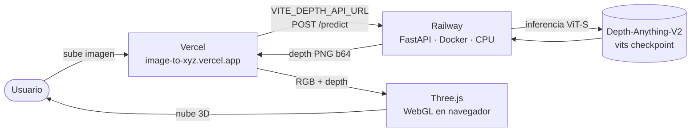
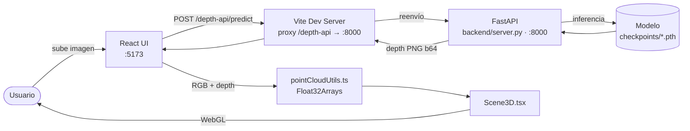
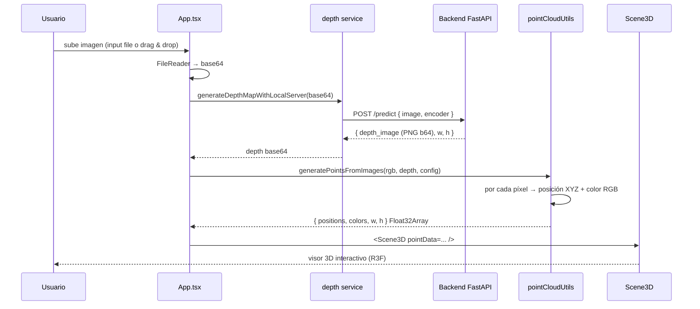

# image_to_xyz

Aplicación web que convierte una **imagen 2D en una nube de puntos 3D navegable** usando un mapa de profundidad estimado por IA. El render se hace en el navegador con Three.js / React Three Fiber.

🌐 **Live demo:**
- **Frontend** → https://image-to-xyz.vercel.app
- **Backend (API)** → https://imagetoxyz-production.up.railway.app

Repo monorepo con dos partes:

- **Frontend** (raíz) — UI en React + Vite, generación de la nube de puntos y visor 3D.
- **Backend** ([`backend/`](./backend)) — FastAPI que envuelve el modelo [Depth-Anything-V2](https://github.com/DepthAnything/Depth-Anything-V2) y lo expone como API REST.

---

## ¿Qué hace?

1. El usuario sube una imagen.
2. Se envía a un proveedor de **estimación de profundidad** (configurable: servidor local/Railway, OpenAI, HuggingFace).
3. El proveedor devuelve un **mapa de profundidad** (escala de grises) del mismo tamaño que la imagen original.
4. El frontend combina la imagen RGB y el mapa de profundidad en una **nube de puntos 3D** (cada píxel se convierte en un punto cuyo color es el del píxel original y cuyo Z viene del mapa de profundidad).
5. La nube se renderiza con WebGL en un visor interactivo (zoom, rotación, parámetros editables).

---

## Arquitectura

### Producción



### Dev local



### Proveedores de profundidad soportados

El componente `Controls.tsx` permite seleccionar entre **3 backends** de estimación de profundidad (definidos en `types.ts` como `DepthModel`):

| Proveedor | Service | Notas |
|-----------|---------|-------|
| `LOCAL_SERVER` (default) | `services/localServerDepthService.ts` | Llama al backend FastAPI (local en dev, Railway en prod). **Recomendado.** |
| `HUGGINGFACE` | `services/gradioDepthService.ts` | Usa el Space público de Gradio. Token HF opcional para más cuota. |
| `OPENAI` | `services/openaiDepthService.ts` | Usa la API de OpenAI Images. Requiere API key del usuario. |

### Flujo interno del frontend



---

## De mapa de profundidad a nube de puntos 3D

Toda la matemática vive en `utils/pointCloudUtils.ts`. La idea: por cada píxel `(x, y)` de la imagen RGB, generamos un **punto 3D `(X, Y, Z)`** cuyo color es el del píxel original y cuya `Z` viene del mapa de profundidad.

### 1. Entradas

- **RGB image** → matriz `width × height × 4` (RGBA, valores 0-255).
- **Depth map** → escala de grises del mismo tamaño. Cada píxel `d ∈ [0, 255]` codifica profundidad: por convención usada aquí, **`255` = cerca, `0` = lejos**.
- **Hiperparámetros** (configurables desde la UI):
  - `sampleRate` (1, 2, 4, 8): muestreamos 1 de cada N píxeles para no generar millones de puntos.
  - `depthScale` (∈ [1, 20]): cuánto exageramos el eje Z.

### 2. Normalización del color

Three.js espera componentes RGB en `[0, 1]`, no `[0, 255]`. Para cada píxel `i`:

$$
r = \frac{\text{rgbData}[i \cdot 4]}{255}, \quad
g = \frac{\text{rgbData}[i \cdot 4 + 1]}{255}, \quad
b = \frac{\text{rgbData}[i \cdot 4 + 2]}{255}
$$

### 3. Coordenadas de imagen → espacio normalizado (NDC-like)

Para un píxel `(x, y)` con `x ∈ [0, W)`, `y ∈ [0, H)`:

$$
u = \frac{x - c_x}{W}, \quad v = -\frac{y - c_y}{H}
$$

donde `c_x = W/2`, `c_y = H/2` son los centros. Esto mapea cada píxel a `u, v ∈ [-0.5, 0.5]` aproximadamente.

> **¿Por qué se invierte `y`?** En coordenadas de imagen el origen está arriba-izquierda y `y` crece **hacia abajo**. En 3D queremos `Y` **hacia arriba**. El signo menos arregla esa inversión.

### 4. Profundidad → eje Z

$$
Z = \frac{d}{255} \cdot s_{\text{depth}}
$$

donde `d` es el valor en escala de grises del depth map (0-255) y `s_depth` es el slider **Depth Exaggeration**. Resultado: `Z ∈ [0, s_depth]`.

> El modelo Depth-Anything-V2 produce profundidad **relativa** (no métrica). Por eso normalizamos a `[0, 1]` y multiplicamos por `s_depth` para controlar la escala visual de forma manual.

### 5. Proyección final a coordenadas 3D

Aplicamos un **factor de spread** de `10` y mantenemos la relación de aspecto multiplicando `Y` por `H/W`:

$$
X = u \cdot 10
$$

$$
Y = v \cdot 10 \cdot \frac{H}{W}
$$

$$
Z = \frac{d}{255} \cdot s_{\text{depth}}
$$

El factor `10` es arbitrario — define el tamaño aparente de la nube en el viewport, y la cámara está colocada en `(0, 0, 15)` para enmarcarlo bien.

> **Modelo simplificado:** esto es una **extrusión ortográfica**, no una verdadera proyección perspectiva. No invertimos la matriz intrínseca de cámara `K^{-1} · [u, v, 1]^T · z` porque no la conocemos (la imagen original puede venir de cualquier cámara). El resultado se ve "perspectivo" porque la profundidad varía píxel a píxel, pero geométricamente es una extrusión a lo largo de Z.

### 6. Empaquetado para Three.js

Three.js consume buffers planos `Float32Array`. Cada punto ocupa **3 floats consecutivos**:

```
positions = [X₀, Y₀, Z₀, X₁, Y₁, Z₁, X₂, Y₂, Z₂, …]
colors    = [r₀, g₀, b₀, r₁, g₁, b₁, r₂, g₂, b₂, …]
```

El número total de puntos es:

$$
N = \left\lceil \frac{W}{s} \right\rceil \cdot \left\lceil \frac{H}{s} \right\rceil
$$

donde `s = sampleRate`. Para una imagen de 1920×1080 con `sampleRate=2`: **N ≈ 518 400 puntos**.

### 7. Pseudocódigo del loop principal

```ts
for (let y = 0; y < H; y += sampleRate) {
  for (let x = 0; x < W; x += sampleRate) {
    const i = (y * W + x) * 4;          // índice base en RGBA

    const u = (x - W/2) / W;
    const v = -(y - H/2) / H;
    const z = (depthData[i] / 255) * depthScale;

    positions[k]   = u * 10;
    positions[k+1] = v * 10 * (H / W);
    positions[k+2] = z;

    colors[k]   = rgbData[i]   / 255;
    colors[k+1] = rgbData[i+1] / 255;
    colors[k+2] = rgbData[i+2] / 255;

    k += 3;
  }
}
```

Estos dos buffers se pasan directo a `THREE.BufferGeometry.setAttribute('position', …)` y `…('color', …)`, y se renderizan con un `THREE.PointsMaterial({ vertexColors: true })`.

### 8. Lo que no estamos haciendo (y se podría)

- **Verdadera proyección perspectiva.** Si supiéramos la focal `f` de la cámara original, el back-projection correcto sería `X = (x - cx) · z / f`, `Y = (y - cy) · z / f`. Sin esa info, la extrusión ortográfica es una buena aproximación visual.
- **Profundidad métrica.** Depth-Anything-V2 tiene una variante "metric depth" (en `backend/metric_depth/`) que da la `z` en metros. La usaríamos para reconstrucción exacta a escala real.
- **Filtrado / outliers.** Píxeles con depth = 0 (fondo de cielo, por ejemplo) generan puntos que se aplastan en `Z=0`. Se podrían descartar con un umbral.
- **Reconstrucción de mesh.** Conectar puntos vecinos (Delaunay, Poisson) para hacer una malla en vez de partículas sueltas.

---

### Estructura de archivos

```
image_to_xyz/
├── App.tsx                           # Estado global, drag & drop, orquestación
├── index.tsx, index.html             # Entry point + CSS global (glass utilities)
├── vite.config.ts                    # Proxy /depth-api → :8000 en dev
├── vercel.json                       # Config de deploy del frontend
├── components/
│   ├── Controls.tsx                  # Selección de modelo, sliders, status
│   └── Scene3D.tsx                   # Visor 3D (React Three Fiber + drei)
├── services/
│   ├── gradioDepthService.ts         # HuggingFace
│   ├── openaiDepthService.ts         # OpenAI
│   └── localServerDepthService.ts    # Backend FastAPI (default)
├── utils/
│   └── pointCloudUtils.ts            # RGB + depth → Float32Array de puntos
├── types.ts                          # AppState, DepthModel, ProcessingConfig
├── .env                              # vars locales (no se commitea)
└── backend/                          # Backend Python (FastAPI + Depth-Anything-V2)
    ├── server.py                     # Wrapper FastAPI (lee PORT, MODEL_ENCODER, CORS_ORIGINS)
    ├── requirements.txt              # Torch CPU + FastAPI + opencv-headless
    ├── Dockerfile                    # Build para Railway / cualquier docker host
    ├── railway.toml                  # Config de Railway (builder, healthcheck)
    ├── depth_anything_v2/            # Código del modelo upstream
    └── checkpoints/                  # .pth (no se commitea, se descarga al arrancar)
```

---

## Cómo arrancar en local

### Requisitos previos

- **Node.js 18+** (`node --version`)
- **Python 3.10+** (`python --version`)
- **Git**
- **~100 MB – 1.3 GB** libres para el checkpoint, según el modelo elegido
- (Opcional) GPU NVIDIA con CUDA o Mac con MPS — si no, corre en CPU

---

### 1. Clona el repo

```bash
git clone git@github.com:Jjat00/image_to_xyz.git
cd image_to_xyz
```

---

### 2. Backend (Terminal 1)

#### 2.1. Entorno virtual e instalación de dependencias

```bash
cd backend

# Crear y activar el venv
python -m venv .venv
source .venv/bin/activate          # Linux/Mac
# .venv\Scripts\activate           # Windows PowerShell

pip install -r requirements.txt
```

> El `requirements.txt` instala torch **CPU-only** por defecto. Si tienes GPU NVIDIA, instala torch con CUDA primero (`pip install torch torchvision`).

#### 2.2. Arranca el servidor

```bash
python server.py
```

El servidor **descarga el checkpoint automáticamente** la primera vez (no necesitas bajarlo a mano). Por defecto usa `vits` (el más liviano, ~100 MB). Salida esperada:

```
Checkpoint no encontrado en .../depth_anything_v2_vits.pth. Descargando…
Descarga completa: ... (95.5 MB)
Cargando modelo Depth-Anything-V2 (vits) en cpu…
Modelo cargado en cpu
INFO:     Uvicorn running on http://0.0.0.0:8000
```

Verifica:
```bash
curl http://localhost:8000/
# {"status":"ok","model":"Depth-Anything-V2","device":"cpu","encoder":"vits"}
```

#### 2.3. Variables de entorno (todas opcionales)

Configurables como variables de entorno antes de `python server.py`:

| Variable | Default | Qué hace |
|----------|---------|----------|
| `MODEL_ENCODER` | `vits` | Encoder del modelo: `vits` (24M) · `vitb` (97M) · `vitl` (335M, calidad referente) |
| `PORT` | `8000` | Puerto a escuchar |
| `CORS_ORIGINS` | `*` | Lista separada por comas de orígenes permitidos |

Ejemplo:
```bash
MODEL_ENCODER=vitl python server.py
```

---

### 3. Frontend (Terminal 2)

```bash
cd /ruta/a/image_to_xyz   # raíz del repo, NO dentro de backend/

npm install               # solo la primera vez
npm run dev
```

Abre **http://localhost:5173**. En el panel "Controls" el proveedor por defecto es **Local Server** y el indicador debe estar en verde 🟢. Sube una imagen o arrástrala.

#### Variables de entorno del frontend (`.env`)

```bash
# Producción (Vercel): apunta al backend de Railway
VITE_DEPTH_API_URL=https://imagetoxyz-production.up.railway.app

# Dev: si está vacío, el frontend usa /depth-api y Vite hace proxy a :8000
```

---

## Deploy en producción

### Backend → Railway

El repo incluye `backend/Dockerfile` y `backend/railway.toml`.

1. **https://railway.app** → New Project → Deploy from GitHub repo → selecciona `image_to_xyz`.
2. **Settings → Source → Root Directory:** `backend`
3. **Variables:**
   - `MODEL_ENCODER` = `vits` (o `vitb` / `vitl`)
   - `CORS_ORIGINS` = la URL de tu deploy de Vercel (sin slash final)
4. **Settings → Networking → Generate Domain** y copia la URL pública.

El servidor descarga el checkpoint en el primer arranque, así que no necesitas commitear los `.pth`.

### Frontend → Vercel

1. **https://vercel.com** → Add New → Project → importa `image_to_xyz`.
2. Framework Preset: **Vite** (autodetectado).
3. **Environment Variables:**
   - `VITE_DEPTH_API_URL` = la URL pública de Railway
4. Deploy. La URL queda algo tipo `image-to-xyz.vercel.app`.

`vercel.json` ignora cambios que solo tocan `backend/` para evitar rebuilds inútiles del frontend.

### Cierra el círculo de CORS

Una vez tengas las dos URLs, vuelve a Railway y aprieta `CORS_ORIGINS` al dominio exacto de Vercel (en lugar de `*`). Railway redeplea solo.

---

## Troubleshooting

| Síntoma | Causa probable | Solución |
|---------|----------------|----------|
| "Servidor offline" en la UI (local) | Backend no está corriendo | Arranca `python server.py` en `backend/` |
| "Servidor offline" en producción | `VITE_DEPTH_API_URL` mal o falta `https://` | Revísalo en Vercel → Settings → Env Vars y **redeplea** (Vercel inyecta env solo en build) |
| CORS error en consola | `CORS_ORIGINS` no incluye tu URL de Vercel | Ajústalo en Railway con la URL exacta |
| `ERR_CONNECTION_RESET` a `localhost:8000` (WSL2) | localStorage guardó URL absoluta vieja | `localStorage.removeItem("depth_server_url")` y recarga |
| Vite no arranca por puerto ocupado | `:5173` en uso | Cambia `port` en `vite.config.ts:9` |
| Mapa de profundidad sale plano | Encoder muy ligero | Cambia `MODEL_ENCODER` a `vitb` o `vitl` (más lento pero más detalle) |
| Inferencia tarda 30s+ | CPU + modelo grande | Usa `vits`, o migra el backend a un host con GPU |

---

## Scripts

```bash
npm run dev       # arranca Vite en :5173 con proxy a :8000 (dev)
npm run build     # build de producción a dist/
npm run preview   # sirve el build localmente
```

---

## Stack

- **Frontend:** React 19 · Vite 6 · Three.js · React Three Fiber · drei · Tailwind (CDN)
- **Backend:** Python 3.11 · FastAPI · Uvicorn · PyTorch (CPU) · Depth-Anything-V2 (DPT + DINOv2)
- **Hosting:** Vercel (frontend) · Railway (backend en Docker)
